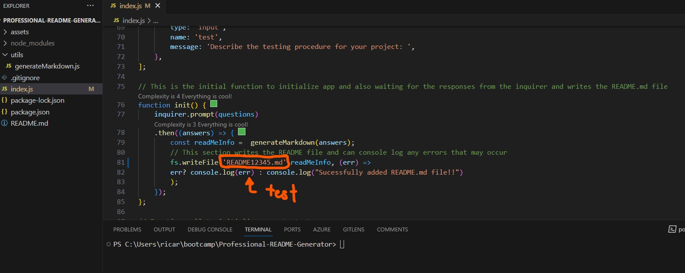
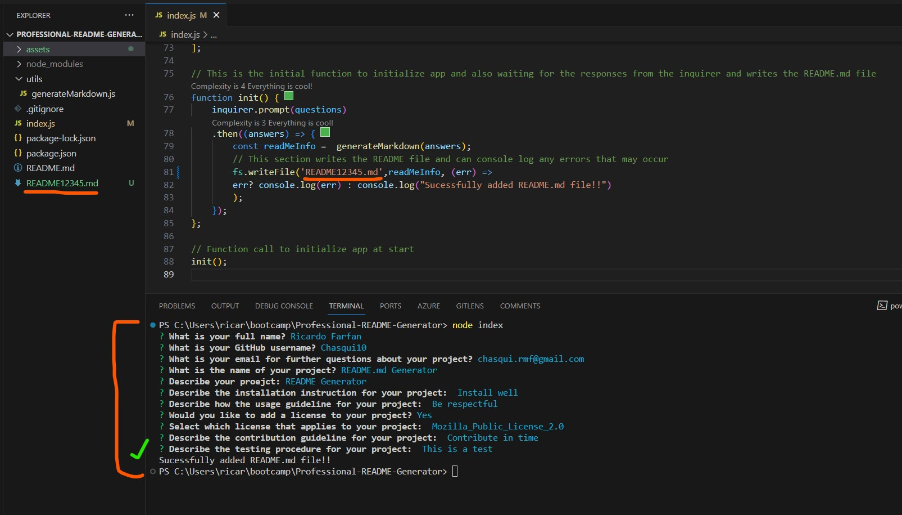
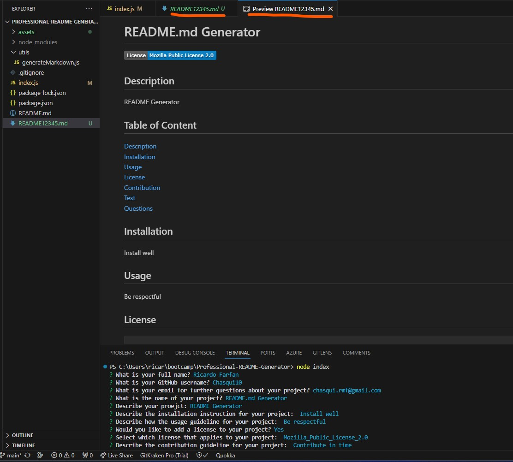
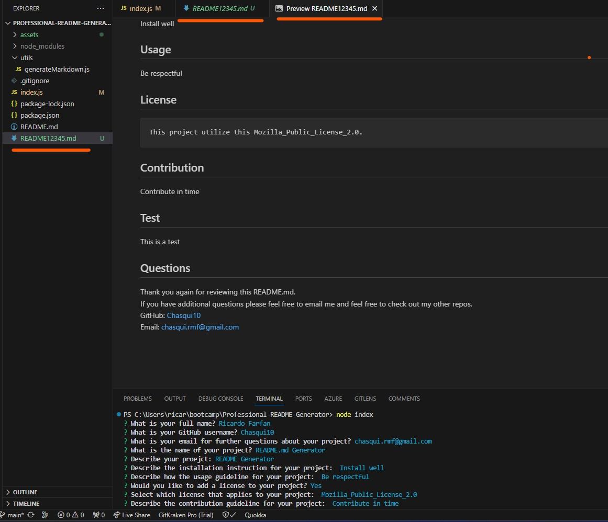

  # README Generator
  
  
  
  ## Description 
  The motivation for this project is utilizing NODE.js and npm packages like Inquirer to help build files for future projects.This project is to builds a professional README.md file for future projects. I learned that this is a format that builds files to secures a consistent professional format.

  ## Table of Content
  [Description](#description) 
  [Installation](#installation) 
  [Usage](#usage) 
  [License](#license) 
  [Contribution](#contribution) 
  [Test](#test) 
  [Questions](#questions) 

  ## Installation
  Ensure that the npm is Inquirer version 8.2.4.  Ensure the script files are linked to each other.
  
  ## Usage
  Open up the terminal for the  applications folder. Install packages and ensure that the correct npm version is used. Open up the terminal for the corresponding application and run node index.js. 

  ## License
    This project utilize this Mozilla_Public_License_2.0.
  
  ## Contribution
  Feel free to review the Questions section and reach out to me first before adding additional code.  
  
  ## Test
  For the index.js script I changed the fs.writeFIle to writea README12345.md instead of the README.md for the final projects.  Below there is an image indicating the test .md file.   

  **Example of README.md name change for test purposes:**  
  

  **Example of Node Index in Terminal:**  
  

  **Example of README12345.md Test Purpose Pt.1:**  
  

  **Example of README12345.md Test Purpose Pt.2:**  
  

  
  ## Questions
  Thank you again for reviewing this README.md.  
  If you have additional questions please feel free to email me and feel free to check out my other repos.  
  GitHub: [chasqui10](https://github.com/chasqui10)  
  Email:  [chasqui.rmf@gmail.com](chasqui.rmf@gmail.com) 
